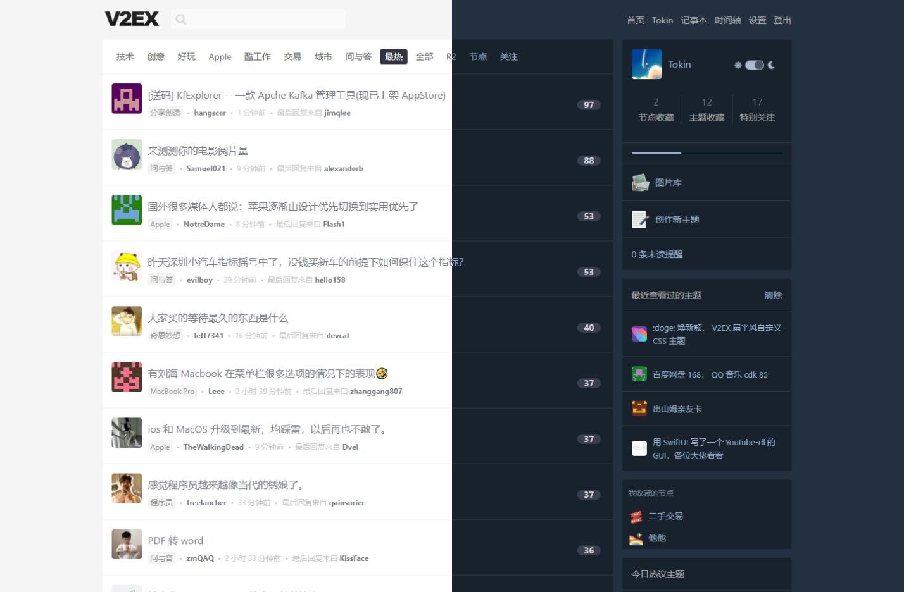

# LIGHTER2

A more concise and modern V2EX theme



## 引入

登陆并访问 https://v2ex.com/settings

开启 **使用自定义 CSS**

在 **自定义 CSS** 处引入 CSS

### jsdelivr 推荐

```
@import "https://cdn.jsdelivr.net/gh/Tokinx/V2EX-THEME-LIGHTER2@master/style.css";
```

### github

```
@import "https://raw.githubusercontent.com/Tokinx/V2EX-THEME-LIGHTER2/main/style.css";
```


## 鸣谢

@jkjoke @yanleijava @abelyao @zzutmebwd@kookxiang @DearTanker @picasso250
